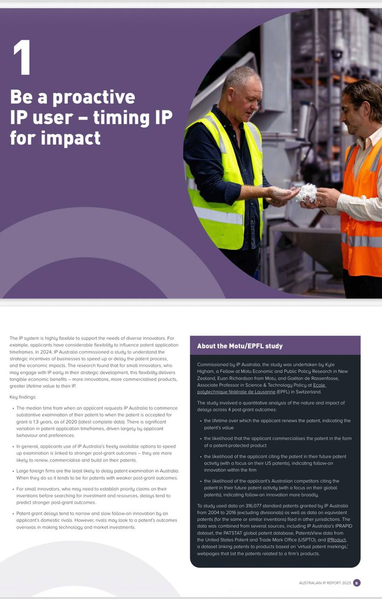
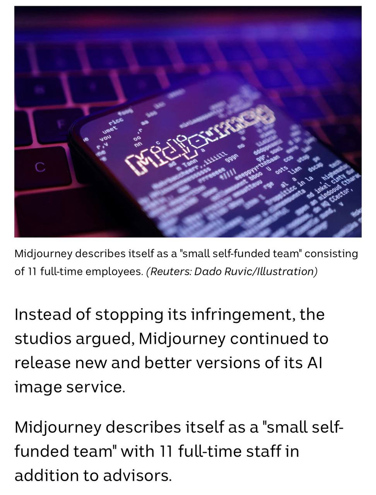

# e-portfolio-3-Intellectual-Property

Disclaimer: This is a student e-portfolio created for COIT11223 ICT Ethics and Governance in Society and is used for educational purposes only.

A collection of artefacts that demonstrate what I have learnt about Intellectual Property this week.

## Artefact 1: Be a Proactive IP User – Timing IP for Impact

**Source:** IP Australia 2025, *Australian IP Report 2025*.

### Summary of the artefact

This artefact from the Australian IP Report 2025 explains how intellectual property protection can be used strategically by innovators and businesses. It focuses on the timing of patent applications and shows that decisions about when to progress a patent can influence its commercial value. The report also explains that effective use of the IP system can help innovators protect their inventions, commercialise products and gain greater long-term value from their intellectual property.

### Justification on why I chose the artefact

I chose this artefact because it helped me understand that intellectual property is not only about stopping other people from copying an idea. Before the Week 7 workshop, I mainly thought of patents as legal protection for inventions. I now understand that IP can also be an important business strategy. This is relevant to me as an IT student because software and technology projects can involve valuable ideas and innovations. As a future ICT professional, I may need to understand how intellectual property can be protected and managed while developing new technology.

## Artefact 2: AI and Copyright – Midjourney Lawsuit

**Source (news article):** ABC News 2025, *Disney and Universal sue AI firm Midjourney for copyright infringement*.

### Summary of the artefact

This ABC News article reports on a copyright lawsuit brought by Disney and Universal against the AI company Midjourney. The studios alleged that Midjourney infringed their copyrighted works through its AI image-generation service. The case demonstrates one of the major challenges created by generative AI because these systems can produce images that resemble existing characters and other protected creative works. It raises questions about how copyright law should apply when AI systems use or reproduce existing creative content.

### Justification on why I chose the artefact

I chose this article because it gives a current real-world example of the copyright issues we discussed during Week 7. What interested me most was the conflict between technological innovation and the rights of original creators. AI companies want to develop more powerful systems, while artists and companies also need protection for the content they create. As an IT student, this made me realise that developing technology is not only about what a system is technically capable of doing. Developers also need to think about whether digital content is being used legally and ethically.

## Artefact 3: Scholarly Article – Copyright Ownership of AI-Generated Works

**Source (scholarly article):** Chen, G, Tong, Y & Han, Z 2026, *Comparative Study on the Ownership of Copyright of Artificial Intelligence-Generated Works*, Laws, vol. 15, no. 4, article 66.

### Summary of the artefact

This scholarly article examines the question of who should own the copyright of works created using artificial intelligence. It compares approaches in different legal systems and discusses whether copyright should belong to the AI user, developer or another party. The article also distinguishes between AI-assisted works, where humans make a significant creative contribution, and content generated more independently by AI. This demonstrates how generative AI is creating new challenges for traditional copyright law.

### Justification on why I chose the artefact

I chose this article because copyright ownership of AI-generated content is becoming an important issue in the technology industry. Before studying intellectual property, I assumed that the person using an AI tool would automatically own the content it produced. This artefact showed me that the situation can be much more complicated and depends on the level of human involvement. As an IT student, I found this particularly relevant because future software systems will increasingly include generative AI. It helped me understand why ICT professionals should consider copyright ownership when developing and using AI systems.
